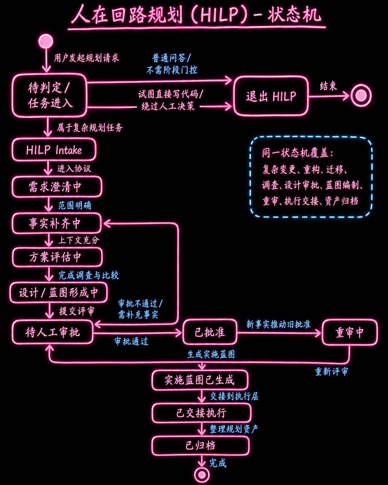
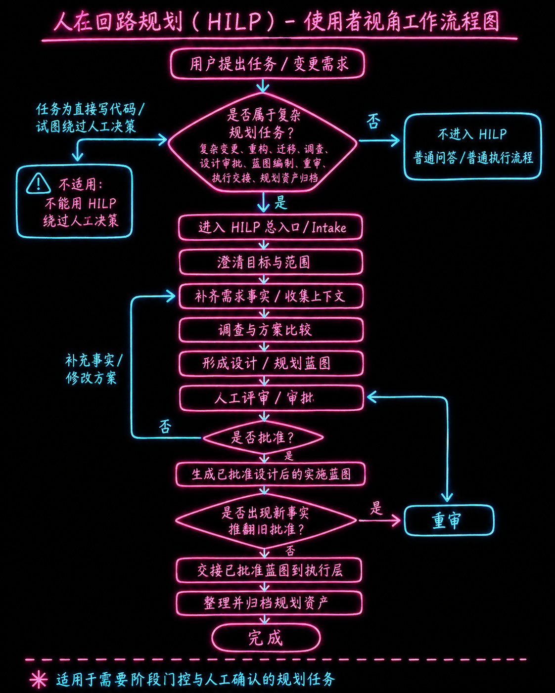
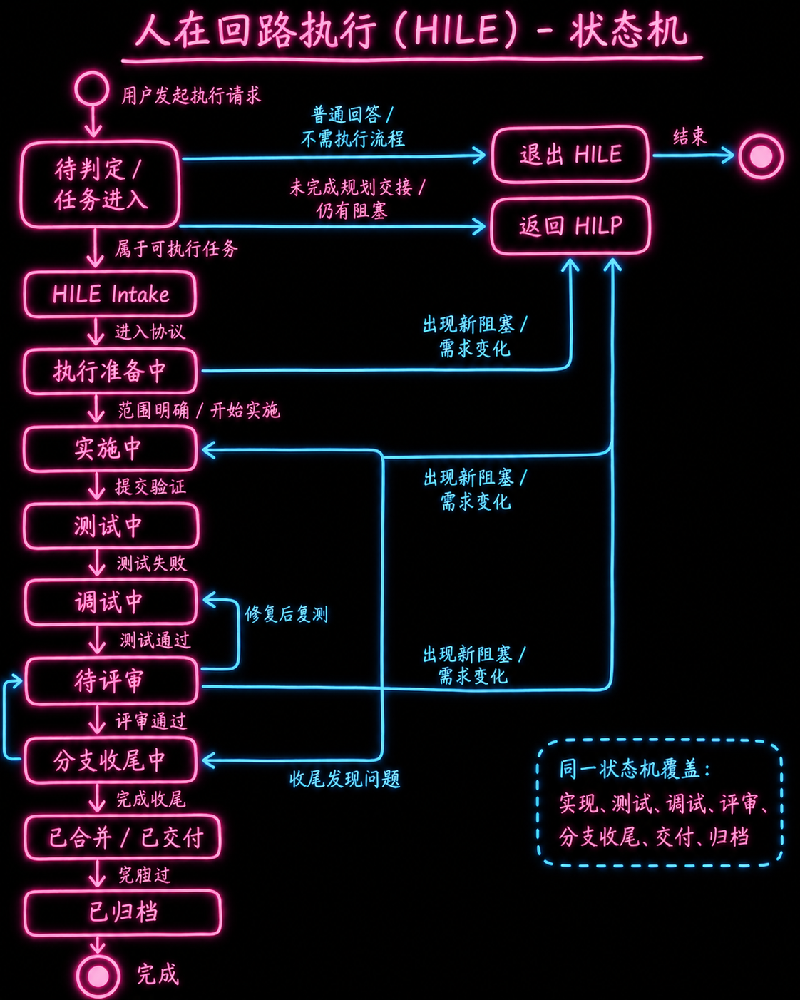
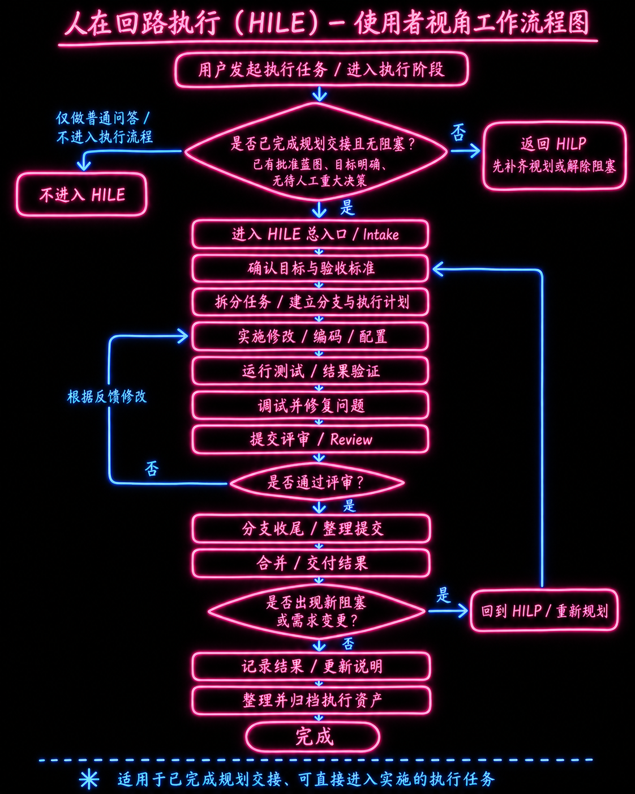

# Skills

本仓库用于沉淀可复用的 AI coding agent 技能、人在回路（HILP/HILE/HILB）协议资料、PRD 写作规范，以及围绕这些技能形成的审查资产。

本仓库是技能源码与资料仓库，不声明仓库内目录会被目标 agent 自动发现。真实使用时，应按目标 agent 的技能安装方式，将需要的技能目录安装或链接到对应环境。

## 当前内容

```text
.
├── cz-sdk-windows-build/
│   ├── SKILL.md
│   ├── references/jdk8-constraint.md
│   └── scripts/*.ps1
├── human-in-loop-planning/
│   ├── SKILL.md
│   ├── README.md
│   ├── agents/openai.yaml
│   ├── references/{agent,human,shared,examples}/...
│   ├── scripts/*.py
│   ├── tests/...
│   ├── generated-file-index.md
│   └── requirements.txt
├── human-in-loop-execution/
│   ├── SKILL.md
│   ├── README.md
│   ├── agents/openai.yaml
│   ├── references/{agent,human,shared,examples}/...
│   ├── scripts/*.py
│   ├── tests/...
│   ├── generated-file-index.md
│   └── requirements.txt
├── human-in-loop-brief/
│   ├── SKILL.md
│   └── references/brief-template.md
├── prd-writer/
│   ├── SKILL.md
│   └── references/*.md
├── rigorous-contrarian-answers/
│   ├── SKILL.md
│   └── agents/openai.yaml
├── prompts/
│   ├── hilb.md
│   ├── hile.md
│   ├── hilp.md
│   └── review-cz_sdk.md
└── docs/
    ├── 人在回路-概念设计稿.md
    ├── 工作流程.png
    ├── HILP_StateMachine.png
    ├── HILP_Workflow.png
    ├── HILE_StateMachine.png
    ├── HILE_Workflow.png
    └── review/*.md
```

## 技能一览

### cz-sdk-windows-build

面向 Windows 环境的 `cz_sdk`、`czsdk-parent`、`czsdk-paycenter` 等 Maven 项目构建与失败诊断技能。

核心约束：

- 构建前必须探测可用 JDK 8。
- 必须通过 `mvn -version` 确认 Maven 当前使用 Java 8。
- 统一使用 `scripts/run_build.ps1` 作为构建入口。
- 构建失败后使用 `scripts/diagnose_build_failure.ps1` 对日志进行分类诊断。
- 环境类失败优先按环境问题处理，不直接跳入源码调试。

入口文档：[`cz-sdk-windows-build/SKILL.md`](cz-sdk-windows-build/SKILL.md)

### human-in-loop-planning

人在回路规划协议（HILP）入口，用于 gated approval、正式 handoff、审计链、高风险变更、多 agent 规划等场景。当前协议为 v2.24；早期 pilot 资产不原地迁移，应按现行协议重新生成。

核心能力：

- 启动分层：确认前只做建议/预检，确认后才进入正式 HILP。
- 支持非落盘预检、保存型预检 scaffold、标准 HILP、严格 HILP。
- 使用 `phase-00` 到 `phase-06`、`phase-99` 的规范阶段体系。
- 产出人类审核视图与 agent 执行视图两套资产，并保持同一事实来源。
- 管理需求事实、设计选择、蓝图、重审、执行交接、归档索引与 review-pack。
- 通过 Python 脚本校验 manifest、资产一致性、链接、占位符、YAML block 和 review-pack。

核心约束：

- 不用于直接写代码或绕过人工决策。
- `ready-for-review` / `ready-for-approval` 不等于 `approved`。
- 正式批准只能使用固定命令，例如 `批准设计：批准 phase-02/design-choice@vN`。
- HILP execution units 是范围与意图契约，不是仓库感知的逐行 patch plan。
- 发现新事实、蓝图缺口、审批缺失、执行范围变化或验证口径变化时，应停止推进并进入 phase-04 重审。

入口文档：[`human-in-loop-planning/SKILL.md`](human-in-loop-planning/SKILL.md)  
补充说明：[`human-in-loop-planning/README.md`](human-in-loop-planning/README.md)  
最初构想说明：[`docs/人在回路-概念设计稿.md`](docs/人在回路-概念设计稿.md)

#### HILP 流程图





### human-in-loop-execution

人在回路执行协议（HILE）入口，仅在已有当前 v2.24 HILP 执行交接资产后使用，用于把已批准设计、已批准蓝图和 execution handoff 落实为受约束的计划、执行、验证、审查与收尾流程。

核心能力：

- 对 approved design、approved blueprint、closed handoff 和 workspace 做入口检查。
- 按 tiny / standard / strict 分级执行。
- 修改文件前生成 repo-aware Plan 或 Runbook，并执行 planned-files scope gate。
- 管理 allowed files、ledger、unit summary、verification record、completion review、failure forensics。
- 通过 Python 脚本校验 intake、allowed files、Plan/Runbook、execution manifest、验证记录、占位符和 review-pack。

核心约束：

- 不负责需求构思、设计审批、蓝图补齐或扩大范围。
- 没有 approved HILP handoff 时，不启动正式 HILE；应回到 HILP。
- standard / strict 执行在修改文件前必须生成并确认 Plan / Runbook。
- 执行确认只能使用固定命令，例如 `确认执行：确认执行 Plan <path>`。
- 完成声明必须有新鲜验证证据，不能用“应该通过”替代。

入口文档：[`human-in-loop-execution/SKILL.md`](human-in-loop-execution/SKILL.md)  
补充说明：[`human-in-loop-execution/README.md`](human-in-loop-execution/README.md)

#### HILE 流程图





### human-in-loop-brief

人在回路简报技能（HILB），由原 `scheme-review-brief` 中文简报能力收敛而来。用于读取 HILP/HILE 规划、执行、交接、manifest、review-pack、runbook、验证、审计等资产，并生成可直接用于会议的中文《方案评审简报》。

核心约束：

- 只做资产解读和简报生成，不启动新的 HILP/HILE 流程。
- 重要结论必须可回溯到资料来源；缺失证据需明确标记。
- 最终输出必须遵循 [`human-in-loop-brief/references/brief-template.md`](human-in-loop-brief/references/brief-template.md) 的结构和语言。

入口文档：[`human-in-loop-brief/SKILL.md`](human-in-loop-brief/SKILL.md)

### prd-writer

面向产品需求文档（PRD）的专业写作、改写、审查与标准化技能，用于把产品想法、业务诉求、会议纪要或既有 PRD 转化为可评审、可开发、可测试、可发布和可复盘的需求资产。

核心能力：

- 从零生成 PRD、改进既有 PRD、审查 PRD 或生成指定章节。
- 根据输入自动路由到 Lite PRD、Standard PRD、Complex PRD、PRD Review、Single Section 或 Product Strategy Clarification Brief。
- 管理事实、假设、开放问题、占位符和追问，避免把不确定信息写成事实。
- 适配中文和英文输出，并保留 `FR-001`、`AC-001`、`EVT-001` 等稳定 ID。
- 提供需求、验收标准、埋点、指标、风险、NFR、权限、数据治理和追溯矩阵等 PRD 结构。

核心约束：

- 默认匹配用户语言。
- 先处理来源材料，再选择输出路线。
- 不把稀薄想法强行扩写成长篇占位 PRD。
- 不编造精确业务数据、研究结论、合规要求、安全约束、模型行为或系统约束。
- 最终输出前必须移除空表格行、括号占位符和未解释的 `TBD`。

入口文档：[`prd-writer/SKILL.md`](prd-writer/SKILL.md)

### rigorous-contrarian-answers

严格反方/批判式回答技能，用于用户明确要求严谨、批判、逆向、无恭维、高细节、前提检验、论证压力测试或置信度分析的场景。

核心约束：

- 先给结论和置信度，再检查前提、反驳薄弱假设并说明证据。
- 不编造事实、引用、日期、统计或来源。
- 对需要外部验证、当前性或内部文件支撑的事实，应先查证再断言。
- 语气直接、精确，但不做人身攻击。

入口文档：[`rigorous-contrarian-answers/SKILL.md`](rigorous-contrarian-answers/SKILL.md)

## 资料与资产目录

- `docs/`：协议图、概念设计稿和仓库级资料。
- `docs/review/`：仓库内既有审查报告。
- `prompts/`：独立 prompt 草案或快捷入口，其中 `hilp.md`、`hile.md`、`hilb.md` 分别用于调用规划、执行和简报技能。
- `human-in-loop-planning/references/`：HILP agent/human/shared/examples 参考资料。
- `human-in-loop-execution/references/`：HILE agent/human/shared/examples 参考资料。
- `human-in-loop-brief/references/brief-template.md`：中文方案评审简报模板。
- `prd-writer/references/`：PRD 路由、模板、质量清单、示例、测试用例和组织定制说明。
- HILP/HILE 正式任务运行时通常会在目标项目的 `docs/changes/<变更概述>/planning|execution|review/` 下生成资产；该路径是协议约定的交付位置，不代表本仓库当前一定保存了所有运行产物。

## 使用方式

1. 根据任务场景选择技能目录。
2. 先读取对应 `SKILL.md`，再按需读取 `references/`、脚本、测试夹具或 prompt 模板。
3. 若目标 agent 不会自动发现本仓库目录，按目标 agent 的安装方式安装或链接对应技能目录。
4. HILP 任务使用 `human-in-loop-planning`；执行交接完成后才使用 `human-in-loop-execution`；最终会议材料或方案摘要可使用 `human-in-loop-brief`。
5. 不要跳过前置环境检查、证据收集、人工批准、确定性检查、执行入口检查、scope gate、脚本校验或完成前验证。

## 维护约定

- 新增技能应使用独立目录，并至少提供 `SKILL.md` 作为入口文档。
- 技能目录应区分入口协议、参考资料、脚本、prompt 模板、测试夹具和资产文件。
- 根 `README.md` 负责登记仓库级目录与技能概览；除非内容不能由 `SKILL.md` 和根 `README.md` 承载，否则避免新增重复的技能包 README。
- 涉及构建、诊断、规划、执行、审查或输出纪律的强约束应写入技能文档，避免只存在于脚本或对话中。
- 仓库内审查报告默认保存到 `docs/review/`；HILP/HILE 运行资产按协议保存到目标项目的 `docs/changes/<变更概述>/...`。
