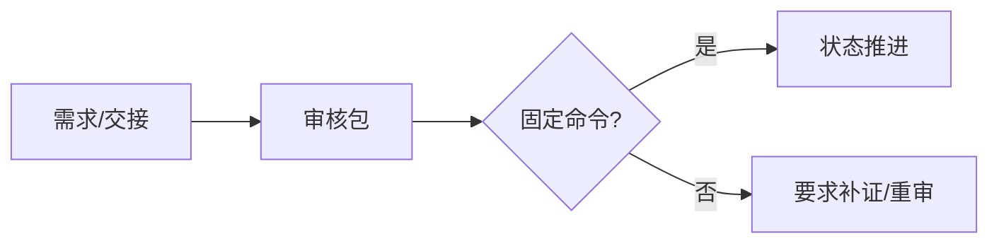

# HILP 审核员完整旅程

1. 从 [00-start.md](00-start.md) 进入，只阅读 human 文件夹和当前 review-pack。
2. 确认目标、非目标、风险、验证标准和唯一正式命令。
3. 遇到新事实、范围变化或验证口径变化时，不批准当前资产，要求进入重审/失败取证路径。

```mermaid
flowchart LR
  A[需求/交接] --> B[审核包]
  B --> C{固定命令?}
  C -- 是 --> D[状态推进]
  C -- 否 --> E[要求补证/重审]
```
